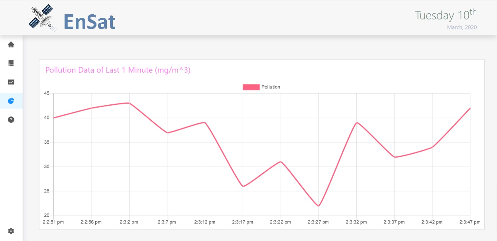

# EnSat

## Introducing EnSat

Project: https://ensat.netlify.app/

EnSat is a miniature version of an Environmental Satellite which helps to record and analyze the environmental parameters as altitude, pressure, temperature, humidity and pollution level.

### Table of Contents

‒ [Tech Stack](#tech-stack)  
‒ [Hosting](#hosting)  
‒ [Project Images](#images)  
‒ [Dev Environment Setup](#environment-setup)

<a id="tech-stack"></a>

## :toolbox: Tech Stack

- Serialport package for data communication
- MongoDB for database
- Express for server
- React for GUI

<a id="hosting"></a>

## :airplane: Hosting

Project is currently hosted on:

- Netlify: [https://ensat.netlify.app/](https://ensat.netlify.app/)
- Server on Heroku (Dummy Data)
  API: https://ensatserver.herokuapp.com/

https://ensatserver.herokuapp.com/getalldata

https://ensatserver.herokuapp.com/getndata/5

https://ensatserver.herokuapp.com/get24hourdata

<a id="images"></a>

## :camera: Project Images

### UI Screenshots





### Hardware:


<a id="environment-setup"></a>

## :hammer: Dev Environment Setup

```bash
> git clone https://github.com/awanshrestha/ensat.git
> cd ensat
> cd client
> npm install
> npm start
```

- Open http://localhost:3000 on your browser to see the project.
